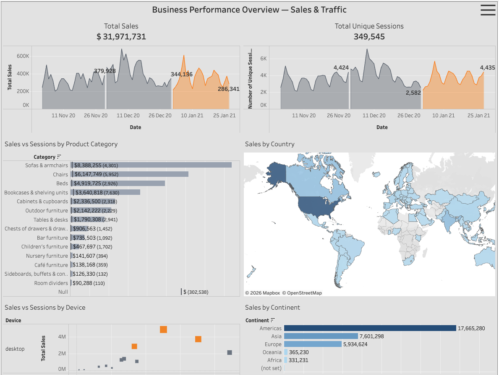

# E-Commerce Sales Performance & Statistical Analysis
Python project analyzing e-commerce sales data to understand product performance, revenue trends, and customer behavior.

## Dashboard Preview

## Business Task
Analyze e-commerce sales data to understand revenue trends, product performance, and customer behavior.

## Tools
SQL, Python (Pandas, NumPy), Data Visualization (Matplotlib, Seaborn, Tableau), Exploratory Data Analysis (EDA), Statistical Analysis

## Key Insights
- Sales performance differs across product categories.
- Some products generate significantly higher revenue.
- Sales trends change over time.
- Statistical analysis helps identify important patterns in sales data.

## Project Notebook
[Open the analysis in Google Colab](https://colab.research.google.com/drive/1KUnWk1gzOp6PYKrnhUwB3O4Utez_7EOy?usp=sharing)

## Interactive Dashboard
[View the interactive dashboard on Tableau Public](https://public.tableau.com/views/BusinessPerformanceOverview_17730067313910/BusinessPerformanceOverviewSalesTraffic?:language=en-GB&:sid=&:redirect=auth&:display_count=n&:origin=viz_share_link)
